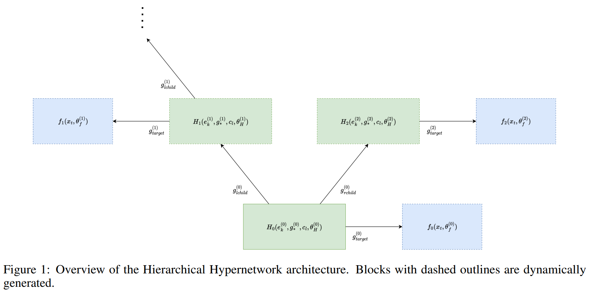
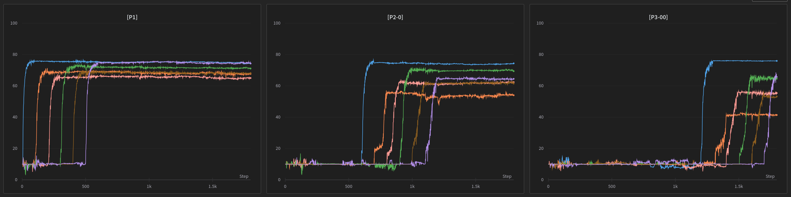

# Hierarchical Hypernetworks

[Motivation](#motivation) - [Intro](#intro) - [Results](#results)

---

## Motivation
It is an established view that memories in the brain are not encoded and stored in isolation, but rather are interleaved with previously acquired related information. Moreover, in recent studies, sleep has been shown to not only integrate new information into established cortical memory networks, but also extract meaning from experience, and serve for developing insights. This points to the interaction between memory and the development of higher-order, conceptual mental representations that support decision-making and other cognitive skills.

**In this project, I focus on the problem of continual knowledge acquisition since I believe it underpins most of the other aspects of intelligence like commonsense reasoning, planning, and creativity**.

## Intro
This was **an exploratory project** in which I investigated the viability of **Hierarchical Hypernetworks** - growing, self-generating memory systems capable of lifelong learning that construct and compress themselves in response to novel tasks.

***Note - what are hypernetworks?**: Hypernetworks, as introduced in [Ha et al. (2016)](https://arxiv.org/abs/1609.09106), are deep neural networks that instead of solving specified tasks directly, output parameters of another target network which is then used for the task at hand. The motivation lies in the ability to condition the parameters of the target network on a specific task and hence introduce something akin to fast weights [(Schmidhuber (1992))](https://ieeexplore.ieee.org/document/6796337), although with much greater power of complete one-step rewriting. Another possible advantage is compression.*

The idea was to extend the work [Continual learning with hypernetworks (Johannes von Oswald et.al. 2019)](https://arxiv.org/abs/1906.00695) by **adding recursion to the hypernetworks architecture**. That is, the previous work conditioned the hypernetwork with a task id such that it predicted the right parameters for the target (*solver*) network (CNN). The intuition why this might be less prone to catastrophic forgetting is that a single neural network that is trained in a continual learning fashion on a sequence of tasks needs to remember all the image → label mappings of all the tasks while the hypernetwork needs to remember only as many mappings as there are tasks (task id → target/solver network parameters).

In this project, I wanted to extend this idea by making the hypernetwork itself a target network for another hypernetwork. This way, the hypernetworks would be able to generate themselves recursively, and hence grow in capacity while keeping the same number of parameters. The architecture is illustrated in the figure below. Since the figure is from a research proposal I wrote for this project, there are a lot of additional details - the important thing is that green boxes are hypernetworks and blue boxes are the target (*solver*) networks (CNNs). As new tasks arrive, new hypernetworks are added to the path from the root hypernetwork $H_0$ to the target networks $f_i$.

## Results
Although I have tried multiple approaches to hypernetwork recursion (not only the one in the figure above), none of them were able to reach the same level of accuracy as a single non-recursive hypernetwork architecture. Why? As the chain of recursively generated hypernetworks gets longer, even very tiny initial errors of the predicted parameters accumulate and the performance of the target network drops significantly. A sample of the results is shown in the figure below. There were 3*6 classification tasks learned sequentially, each consisting of different 10 CIFAR-100 classes.
- The leftmost plot shows the accuracy of the target network (CNN) at the path **root hypernetwork → target (solver) network**;
- the middle plot shows the accuracy of the target network at the path **root hypernetwork → hypernetwork → target (solver) network**;
- the rightmost plot shows the accuracy of the target network at the path **root hypernetwork → hypernetwork → hypernetwork → target (solver) network**.

As one can see, the performance of the target network drops significantly as the chain of hypernetworks gets longer. Furthermore, this high sensitivity on hypernetwork parameter prediction errors causes the training to be unstable and the accuracy to fluctuate a lot.

Taken together, **I discontinued this project** since the results were not promising in comparison to other projects I was working on at the time. However, I believe that the idea of hypernetworks for continual learning is very promising and I would like to revisit it in the future - perhaps with more emphasis on forward and backward transfer which this approach so far lacks.

